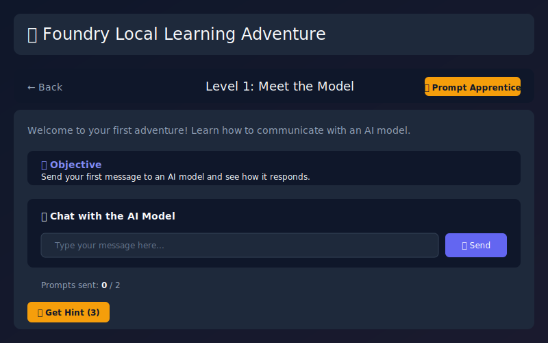
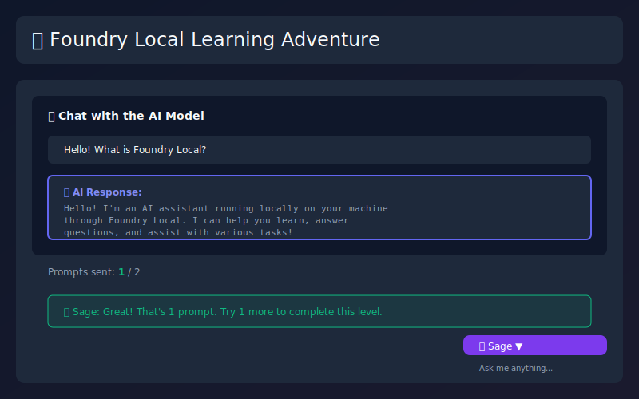
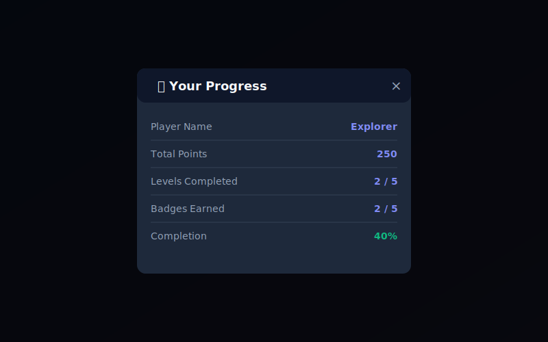
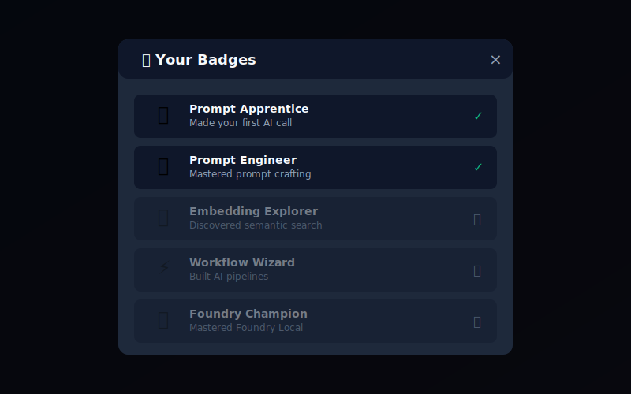

# 🎮 Foundry Local Learning Adventure

> **Learn AI development by playing a game!** A fun, interactive JavaScript adventure that teaches you how to use Microsoft Foundry Local and AI tools - one level at a time.

[](https://nodejs.org/)
[](LICENSE)
[](https://learn.microsoft.com/azure/ai-studio/foundry-local)
[](https://leestott.github.io/FoundryLocal-LearningAdventure/)

---

## 🌐 Play Online Now!

**No installation required!** Play the web version directly in your browser:

👉 **[Play Foundry Learning Adventure](https://leestott.github.io/FoundryLocal-LearningAdventure/)** 👈

The web version includes all 5 levels and works completely in your browser with simulated AI responses.

---

## 📋 Table of Contents

- [What is This Game?](#-what-is-this-game)
- [What You'll Learn](#-what-youll-learn)
- [Play Online (GitHub Pages)](#-play-online-github-pages)
- [Quick Start](#-quick-start-5-minutes)
- [Installation Guide](#-detailed-installation-guide)
- [How to Play](#-how-to-play)
- [Level Guide](#-level-guide)
- [Game Screenshots](#-game-screenshots)
- [Commands Reference](#-commands-reference)
- [Rewards & Badges](#-rewards--badges)
- [Deploy to GitHub Pages](#-deploy-to-github-pages)
- [Troubleshooting](#-troubleshooting)
- [FAQ](#-frequently-asked-questions)
- [Project Structure](#-project-structure)
- [Running Tests](#-running-tests)
- [Contributing](#-contributing)

---

## 🎯 What is This Game?

The **Foundry Local Learning Adventure** is an educational game designed for **complete beginners** who want to learn about:

- 🤖 **AI/ML Basics** - How AI models work and respond
- 💬 **Prompt Engineering** - Writing effective prompts
- 🔍 **Embeddings** - How AI understands meaning
- ⚡ **AI Workflows** - Chaining operations together
- 🔧 **Tool Building** - Extending AI capabilities

You don't need any prior AI experience! Just follow along, complete challenges, and earn badges as you learn.

### Who is this for?

- 👨‍🎓 **Students** learning about AI
- 👩‍💻 **Developers** new to AI tools
- 🎨 **Anyone** curious about how AI works
- 📚 **Educators** teaching AI concepts

---

## 📚 What You'll Learn

| Level | Topic | What You'll Master |
|-------|-------|-------------------|
| 1 | **Meet the Model** | Making your first AI API call |
| 2 | **Prompt Mastery** | Writing effective prompts |
| 3 | **Embeddings Explorer** | Semantic search & similarity |
| 4 | **Workflow Wizard** | Building AI pipelines |
| 5 | **Build Your Own Tool** | Creating custom AI tools |

---

## 🎮 Play Online (GitHub Pages)

### 🌐 No Installation Required!

The easiest way to play is directly in your browser. The web version:

- **Works immediately** - just click and play
- **No downloads** - runs entirely in browser
- **Interactive learning** - all 5 levels included
- **Progress saved** - uses browser localStorage
- **Mobile friendly** - works on phones/tablets

#### How to Access

1. **Public version**: Visit the deployed GitHub Pages URL
2. **Your own copy**: Fork the repo and enable GitHub Pages

#### Web vs Terminal Version

| Feature | Web | Terminal |
|---------|-----|----------|
| No installation | ✅ | ❌ |
| Mobile support | ✅ | ❌ |
| Share with friends | ✅ | ❌ |
| Real AI responses | ❌ | ✅ |
| Foundry Local | ❌ | ✅ |
| Full CLI experience | ❌ | ✅ |

**Recommendation**: Start with the **web version** to learn the concepts, then try the **terminal version** with Foundry Local for real AI interactions!

---

## 🚀 Quick Start (5 Minutes)

### Windows Users (Easiest!)

1. **Download** or clone this repository
2. **Navigate** to the `game` folder
3. **Double-click** `start-game.bat`
4. **Follow** the on-screen prompts
5. **Start playing!**

### Mac/Linux Users

```bash
# Clone the repository
git clone <repository-url>
cd game

# Make the script executable
chmod +x start-game.sh

# Run the game
./start-game.sh
```

### Using npm Directly

```bash
cd game
npm install
npm start
```

---

## 📖 Detailed Installation Guide

### Step 1: Install Node.js

Node.js is required to run this game. It's free and easy to install.

#### Windows
1. Visit [nodejs.org](https://nodejs.org/)
2. Download the **LTS** version (green button)
3. Run the installer
4. Click "Next" through all options
5. **Restart your terminal** after installing
6. Done! ✅

#### macOS
```bash
# Using Homebrew (recommended)
brew install node

# Or download from nodejs.org
```

#### Linux (Ubuntu/Debian)
```bash
sudo apt update
sudo apt install nodejs npm
```

#### Verify Installation
Open a terminal/command prompt and type:
```bash
node --version
```
You should see something like `v18.x.x` or higher.

---

### Step 2: Download the Game

#### Option A: Download ZIP
1. Click the green "Code" button on the repository page
2. Select "Download ZIP"
3. Extract to a folder you can easily find (e.g., Desktop)

#### Option B: Clone with Git
```bash
git clone https://github.com/leestott/FoundryLocal-LearningAdventure.git
cd FoundryLocal-LearningAdventure
```

---

### Step 3: Install Dependencies

Open a terminal in the `game` folder:

```bash
cd game
npm install
```

This downloads all required packages. You only need to do this once.

---

### Step 4: (Optional) Install Foundry Local

The game works **without** Foundry Local (in demo mode), but for the full AI experience:

#### Windows
```bash
winget install Microsoft.FoundryLocal
```

#### Start a Model
```bash
foundry model run Phi-4
```

**Keep this terminal open** while you play! The model needs to be running.

---

### Step 5: Run the Game!

#### Option A: Use the Startup Script (Recommended)
- **Windows**: Double-click `game/start-game.bat`
- **Mac/Linux**: Run `./game/start-game.sh`

#### Option B: Use npm
```bash
npm start
```

---

## 🎮 How to Play

When you start the game, you'll see a welcome screen:

```
╔══════════════════════════════════════════════════════════════════╗
║     🎮 FOUNDRY LOCAL LEARNING ADVENTURE 🎮                       ║
║                                                                  ║
║     Master Microsoft Foundry AI - One Level at a Time!           ║
╚══════════════════════════════════════════════════════════════════╝
```

### Basic Gameplay

1. **Start a level**: Type `play 1` to start Level 1
2. **Follow instructions**: Each level explains what to do
3. **Complete the task**: Try the challenge
4. **Get help if stuck**: Type `hint` for tips
5. **Earn rewards**: Complete levels to unlock badges!

### Your Mentor: Sage 🧙

Throughout the game, **Sage** will guide you:
- 📖 Introduces each level
- 💡 Provides helpful hints
- ❓ Answers your questions
- 🎉 Celebrates your wins!

Type `ask [your question]` anytime to chat with Sage.

---

## 📚 Level Guide

### Level 1: Meet the Model 🎯

**What you'll do**: Send your first message to an AI and get a response.

**What you'll learn**:
- How AI models communicate
- The request/response pattern
- What happens when you call an AI

**Example**:
```
Your prompt: Hello! Please introduce yourself.
```

**Tips**:
- Just type a friendly greeting
- Watch how the AI responds
- There's no wrong answer here!

**Badge Earned**: 🎯 Prompt Apprentice (100 points)

---

### Level 2: Prompt Mastery ✍️

**What you'll do**: Improve a poorly written prompt and compare results.

**What you'll learn**:
- Why prompt quality matters
- How to be specific and clear
- The difference good prompts make

**The Challenge**:
```
Bad prompt:  "tell me stuff about coding"
Your task:   Write a better version!
```

**Tips**:
- Be specific (what topic? what language?)
- Add context (your skill level, format wanted)
- Ask for examples

**Badge Earned**: ✍️ Prompt Engineer (150 points)

---

### Level 3: Embeddings Explorer 🔍

**What you'll do**: Search a knowledge base using semantic similarity.

**What you'll learn**:
- How AI understands meaning (not just keywords)
- What embeddings are and how they work
- How semantic search finds related content

**Example**:
```
Your query: "How do I run AI offline?"
Result: Finds content about Foundry Local's offline capabilities
```

**Tips**:
- Think about meaning, not exact words
- Try different ways of asking the same thing
- See how similar concepts connect

**Badge Earned**: 🔍 Embedding Explorer (200 points)

---

### Level 4: Workflow Wizard ⚡

**What you'll do**: Build a 3-step AI pipeline that processes text.

**What you'll learn**:
- How to chain AI operations together
- Passing output from one step to the next
- Automating complex multi-step tasks

**The Pipeline**:
```
Step 1: Summarize text
    ↓
Step 2: Extract keywords
    ↓
Step 3: Generate questions
```

**Tips**:
- Watch how each step uses the previous output
- Think about other workflows you could build
- This is how real AI applications work!

**Badge Earned**: ⚡ Workflow Wizard (250 points)

---

### Level 5: Build Your Own Tool 🔧

**What you'll do**: Create a JavaScript function and let AI use it.

**What you'll learn**:
- What AI tools/functions are
- How agents call external code
- Extending what AI can do

**Example Tool**:
```javascript
// A simple calculator tool
function add_numbers(a, b) {
    return a + b;
}
```

**Tips**:
- Keep your function simple
- Add clear descriptions
- The AI will learn to call your tool!

**Badge Earned**: 🏆 Foundry Champion (300 points)

---

## � Game Screenshots

### Welcome Screen
When you first open the game, you'll see a friendly welcome screen:


### Main Menu - Level Selection
After entering your name, choose from 5 progressive levels:


### Level 1 - Meet the Model
Your first interaction with an AI model:



### AI Response
Watch the AI respond to your prompts in real-time:



### Sage - Your AI Mentor
Get help anytime from Sage, your friendly mentor:


### Hint System
Stuck? Use hints to guide your learning:


### Progress Tracking
Track your points, badges, and completion status:



### Badge Collection
Earn badges as you master each concept:



> **Note**: Screenshots are from the web version. The terminal version has similar functionality with a text-based interface.

---

## �💻 Commands Reference

| Command | What It Does | Example |
|---------|--------------|---------|
| `play [n]` | Start level n | `play 1` |
| `levels` | Show all levels | `levels` |
| `progress` | View your stats | `progress` |
| `badges` | See earned badges | `badges` |
| `hint` | Get a hint | `hint` |
| `ask [text]` | Ask the mentor | `ask what are embeddings?` |
| `explain [x]` | Explain a concept | `explain prompt engineering` |
| `help` | Show commands | `help` |
| `reset` | Reset progress | `reset` |
| `quit` | Save & exit | `quit` |

---

## 🏆 Rewards & Badges

### Badges You Can Earn

| Badge | Level | Points | For |
|-------|-------|--------|-----|
| 🎯 Prompt Apprentice | 1 | 100 | First AI call |
| ✍️ Prompt Engineer | 2 | 150 | Better prompts |
| 🔍 Embedding Explorer | 3 | 200 | Semantic search |
| ⚡ Workflow Wizard | 4 | 250 | AI pipelines |
| 🏆 Foundry Champion | 5 | 300 | All complete! |

### Point Milestones

| Points | Title | You're... |
|--------|-------|-----------|
| 100 | Beginner | Just getting started! |
| 250 | Learner | Making progress! |
| 500 | Practitioner | Getting skilled! |
| 750 | Expert | Almost a master! |
| 1000 | Master | You've done it all! |

### Achievements

- 👣 **First Steps** - Complete your first level
- 🌟 **Halfway Hero** - Complete 50% of levels
- ⚡ **Speed Learner** - Complete a level in under 5 minutes
- 🧠 **Hint-Free Hero** - Complete without using hints
- ❓ **Curious Mind** - Ask 10 questions
- 🎓 **Master Graduate** - Complete everything!

---

## 🌍 Deploy to GitHub Pages

Deploy your own copy of the game to GitHub Pages for free hosting!

### Option 1: Automatic (GitHub Actions) - Recommended

1. **Fork this repository** to your GitHub account

2. **Enable GitHub Pages**:
   - Go to your repo's **Settings** → **Pages**
   - Source: Select **GitHub Actions**

3. **Push to main branch** - deployment happens automatically!

4. **Access your game** at: `https://YOUR-USERNAME.github.io/FoundryLocal-LearningAdventure/`

### Option 2: Manual Deployment

1. **Fork this repository**

2. **Enable GitHub Pages**:
   - Go to **Settings** → **Pages**
   - Source: **Deploy from a branch**
   - Branch: `main`
   - Folder: `/game/web`

3. **Wait 2-3 minutes** for deployment

4. **Visit** `https://YOUR-USERNAME.github.io/FoundryLocal-LearningAdventure/`

### Local Testing of Web Version

Test the web version locally before deploying:

```bash
# Navigate to web folder
cd game/web

# Install a simple HTTP server (if needed)
npm install -g http-server

# Start the server
http-server -p 8080 -c-1

# Open in browser
start http://localhost:8080  # Windows
open http://localhost:8080   # macOS
xdg-open http://localhost:8080  # Linux
```

### Web Version Features

The GitHub Pages version includes:
- ✅ All 5 levels with full interactivity
- ✅ AI mentor Sage with helpful responses
- ✅ Progress saved in browser localStorage
- ✅ Badge and achievement system
- ✅ Hint system for each level
- ✅ Mobile responsive design
- ✅ Works completely offline after first load
- ⚠️ Uses simulated AI responses (no real Foundry Local)

For the **full AI experience** with real model responses, use the Node.js terminal version with Foundry Local installed.

---

## ❓ Troubleshooting

### "Node.js not found" or "node is not recognized"

**What happened**: Node.js isn't installed or isn't in your PATH.

**Fix**:
1. Download Node.js from [nodejs.org](https://nodejs.org/)
2. Choose the **LTS** version
3. Run the installer (accept defaults)
4. **Close and reopen your terminal**
5. Try again

---

### "Foundry Local not detected"

**What happened**: The game can't connect to Foundry Local.

**This is OK!** The game will work in "demo mode" with simulated responses.

**To enable full AI**:
1. Open a **new terminal**
2. Install: `winget install Microsoft.FoundryLocal`
3. Start model: `foundry model run Phi-4`
4. **Keep that terminal open**
5. Start the game in a **different terminal**

---

### "Cannot find module" or "MODULE_NOT_FOUND"

**What happened**: Dependencies aren't installed.

**Fix**:
```bash
cd game
npm install
npm start
```

---

### "Progress not saving"

**What happened**: The game can't write to the progress file.

**Fix**:
- Use `quit` command to exit (not Ctrl+C)
- Check that `data/progress.json` exists
- Make sure you have write permission
- Try: `npm run reset` to create a fresh progress file

---

### "Game is frozen" or "Taking too long"

**What happened**: AI call is taking a while.

**Fix**:
- Wait 10-15 seconds (AI can be slow)
- If Foundry Local: check it's still running
- Press Ctrl+C to cancel and try again
- The game will use demo mode if AI is unavailable

---

## 🤔 Frequently Asked Questions

### Do I need to know programming?

**No!** The game teaches concepts through interaction. You'll learn as you go.

### Do I need internet access?

**No!** Everything runs on your computer. That's what "Local" means.

### Do I need Foundry Local installed?

**No!** The game has a demo mode. But you'll get better responses with it.

### Can I skip levels?

**No**, levels unlock in order. Each one builds on previous concepts.

### How long does it take to complete?

Most people finish in **1-2 hours**. Take your time and enjoy!

### What if I make a mistake?

**No problem!** That's how you learn. Use `hint` or `ask` for help.

### Can I replay completed levels?

**Yes!** Type `play [number]` to replay any level.

### How do I reset my progress?

Type `reset` in the game, or run `npm run reset`.

---

## 📁 Project Structure

```
FoundryLocal-LearningAdventure/
├── README.md               # This file!
├── LICENSE                 # MIT License
├── CONTRIBUTING.md         # Contribution guidelines
├── SECURITY.md             # Security policy
├── .gitignore              # Git ignore rules
├── .github/                # GitHub configuration
│   └── workflows/          # CI/CD workflows
│       ├── deploy.yml      # GitHub Pages deployment
│       └── test.yml        # Automated testing
└── game/                   # Game source code
    ├── src/                # Source code (Node.js version)
    │   ├── game.js         # Main game engine
    │   ├── levels.js       # Level management & tasks
    │   └── mentor.js       # AI mentor (Sage)
    ├── web/                # Web version (GitHub Pages)
    │   ├── index.html      # Main HTML page
    │   ├── styles.css      # Game styling
    │   ├── game-web.js     # Web game engine
    │   └── game-data.js    # Levels, rewards, mentor data
    ├── data/               # Game data (JSON)
    │   ├── levels.json     # Level definitions
    │   ├── rewards.json    # Badges & achievements
    │   └── progress.json   # Your saved progress
    ├── screenshots/        # Game screenshots
    ├── tests/              # Test files
    ├── start-game.bat      # Windows launcher
    ├── start-game.ps1      # PowerShell launcher
    ├── start-game.sh       # Mac/Linux launcher
    ├── config.json         # Settings
    └── package.json        # Node.js configuration
```

---

## 🧪 Running Tests

Make sure everything is working:

```bash
# Run all tests
npm test

# Check Foundry Local status (Windows)
npm run test:foundry

# Reset your progress
npm run reset
```

### Running Web Screenshot Tests

Capture screenshots automatically using Playwright:

```bash
# Navigate to game folder
cd game

# Install Playwright (first time only)
npm run test:install

# Capture all screenshots
npm run test:screenshots
```

Screenshots are saved to `game/screenshots/`.

Test output shows:
- ✅ Passed tests (green)
- ❌ Failed tests (red)  
- ⏭️ Skipped tests (yellow - usually means Foundry Local not running)

---

## ⚙️ Configuration

Edit `config.json` to customize:

```json
{
  "foundryLocal": {
    "baseUrl": "http://localhost:5272",
    "defaultModel": "Phi-4"
  },
  "game": {
    "maxHintsPerLevel": 3,
    "demoModeEnabled": true
  }
}
```

### Common Changes

- **Different port**: Change `baseUrl` if Foundry runs elsewhere
- **Different model**: Change `defaultModel` to your preferred model
- **More hints**: Increase `maxHintsPerLevel`

---

## 🤝 Contributing

We welcome contributions! Here's how:

1. **Fork** the repository
2. **Create** a branch: `git checkout -b my-feature`
3. **Make** your changes
4. **Test**: `npm test`
5. **Commit**: `git commit -m "Add my feature"`
6. **Push**: `git push origin my-feature`
7. **Open** a Pull Request

### Ideas for Contributions

- 🆕 New levels teaching more concepts
- 🌍 Translations to other languages
- 🎨 Visual/UX improvements
- 🐛 Bug fixes
- 📖 Documentation improvements
- 🧪 More tests

---

## 📚 Learn More

- [Foundry Local Documentation](https://learn.microsoft.com/azure/ai-studio/foundry-local)
- [Prompt Engineering Guide](https://learn.microsoft.com/azure/ai-services/openai/concepts/prompt-engineering)
- [Understanding Embeddings](https://learn.microsoft.com/azure/ai-services/openai/concepts/understand-embeddings)
- [AI Fundamentals Learning Path](https://learn.microsoft.com/training/paths/get-started-with-artificial-intelligence-on-azure/)

---

## 📄 License

MIT License - Feel free to use, modify, and share!

See [LICENSE](LICENSE) for details.

---

## 💬 Get Help

- 🐛 **Bug?** Open an issue
- 💡 **Idea?** Start a discussion
- ❓ **Question?** Check FAQ or open an issue

---

<div align="center">

**🎮 Happy Learning! ✨**

*Built with ❤️ for the Foundry Local community*

[⬆ Back to Top](#-foundry-local-learning-adventure)

</div>
