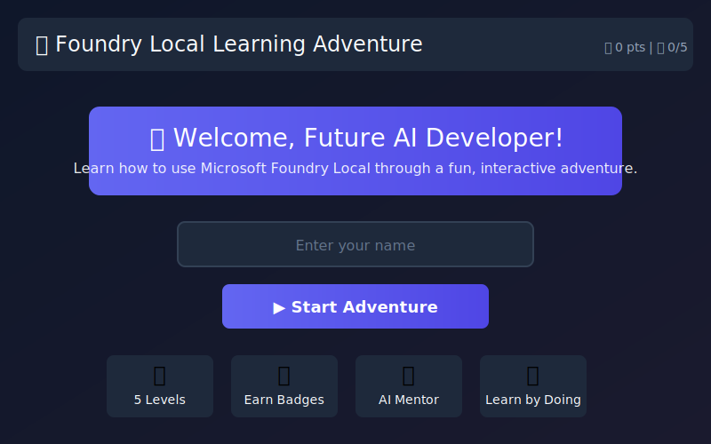
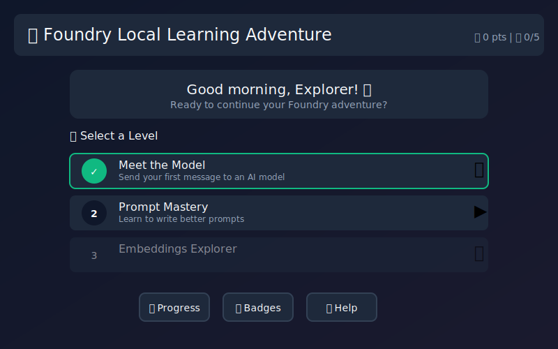
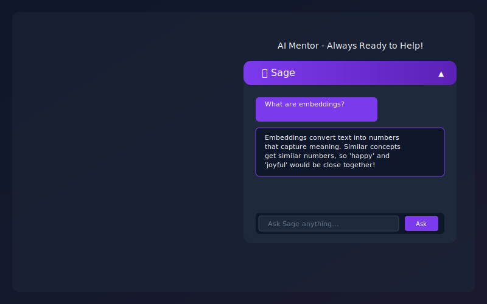

# Leveling Up AI Learning: Behind the Foundry Local Learning Adventure

*Published January 28, 2026*

Building delightful AI learning experiences does not have to be a mystery. The Foundry Local Learning Adventure shows how a handful of thoughtful design decisions can turn abstract concepts like prompt engineering and embeddings into a playful journey that runs entirely on your machine. This post highlights the ingredients you can reuse to craft your own inspiring AI education experiences.

## A Game That Teaches While You Play

- **Mentored progression:** Five narrative levels, guided by Sage the in-game mentor, cover first prompts through tool-building. Each level layers a single new AI concept so players never feel lost.
- **Every environment:** The same content powers a terminal-first experience for model tinkerers and a browser-friendly version for instant demos—perfect for hackathons or classrooms.
- **Offline-first mindset:** By default the game connects to Microsoft Foundry Local; if that is unavailable it gracefully falls back to Microsoft Foundry and Azure OpenAI or a fully simulated demo mode, keeping the learning loop unbroken.

## Scenes From Inside the Adventure







These SVG screenshots (captured directly from the web client) make it easy to reuse the visual language in presentations or developer docs.

## Architecture in 90 Seconds

1. **Content layer:** JSON files in `game/data/` define levels, hints, rewards, and sample prompts so writers and engineers can collaborate without stepping on each other.
2. **Game engine:** `game/src/` houses the Node.js engine that orchestrates progress, mentor dialogue, and AI requests. The same logic feeds both CLI and web builds, ensuring parity.
3. **Connectors:** Startup scripts in `game/scripts/` wire everything together for Windows, macOS, and Linux, and web boot scripts serve the SPA version from `game/web/`.

Because the engine persists progress to disk and mirrors it in `localStorage` on the web, learners can pause anywhere and pick back up without losing badges.

## Code Spotlight: Adaptive AI Connections

A big inspiration for other builders is how the `FoundryLocalClient` automatically escalates through connection options before falling back to demo mode:

```javascript
class FoundryLocalClient {
  constructor(options = {}) {
    this.baseUrl = options.baseUrl || 'http://127.0.0.1:61341';
    this.model = options.model || 'Phi-3.5-mini-instruct-generic-cpu:1';
    this.connectionMode = 'demo';
    this.azureConfig = options.azureConfig || null;
    this.autoDiscoverPort = options.autoDiscoverPort !== false;
    this.commonPorts = options.commonPorts || [61341, 5272, 5000, 8080];
  }

  async initialize() {
    console.log('[*] Checking Foundry Local...');
    if (await this.tryFoundryLocal()) {
      this.connectionMode = 'local';
      return true;
    }
    if (this.azureConfig?.enabled && await this.tryAzureFoundry()) {
      this.connectionMode = 'azure';
      return true;
    }
    this.connectionMode = 'demo';
    return false;
  }
}
```

Feel free to copy this pattern into your own agents. The triage between local, cloud, and simulated responses keeps workshops moving even when someone forgets to start their model.

## Try the Adventure in Minutes

| Experience | Best For | Command
| --- | --- | --- |
| **Play instantly in the browser** | Demos, classrooms, sharing links | [GitHub Pages build](https://leestott.github.io/FoundryLocal-LearningAdventure/)
| **Run the CLI with real local models** | Deep dives, traceable prompts | `cd game && npm install && npm start`
| **Automate setup** | New contributors, scripted labs | `scripts/start-game.ps1` (Windows) or `scripts/start-game.sh` (macOS/Linux)


## Remix Ideas for Your Own Build

1. **Swap the syllabus:** Edit `game/data/levels.json` to teach your domain—security copilot workflows, custom GPT operations, or agent evaluation basics.
2. **Inject real tools:** Follow Level 5’s pattern to register functions (think vector searchers or DevOps runbooks) that characters can call.
3. **Add observability:** Hook tracing into `FoundryLocalClient.chat()` so learners can open a dashboard and watch tokens flow in real time.
4. **Ship it everywhere:** Use the included GitHub Actions workflow to deploy your variant to Pages—then let learners fork-and-go.

## Call to Adventure

The entire project is open source under MIT. Fork it, remix it, and share what you build:

👉 **[Explore the repo and start playing](https://github.com/leestott/FoundryLocal-LearningAdventure)**

Tag your creations with #FoundryLocal so the community can celebrate every new learning quest you design.
